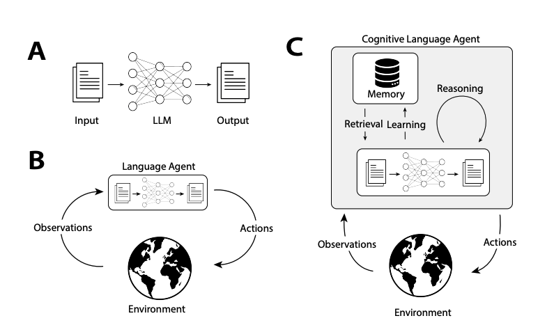

# LLM Agentic Memory Systems

## Table of Contents
1. [Introduction](#introduction)
2. [Types of Agentic Memory](#types-of-agentic-memory)
   1. [Working Memory](#1-working-memory)
   2. [Episodic Memory](#2-episodic-memory) 
   3. [Semantic Memory](#3-semantic-memory)
   4. [Procedural Memory](#4-procedural-memory)
3. [Why Agentic Memory Matters](#why-agentic-memory-matters)
4. [Agentic Memory vs. RAG vs. Agentic RAG](#agentic-memory-vs-rag-vs-agentic-rag)
5. [Implementing Agentic Memory](#implementing-agentic-memory)
6. [Real-World Examples](#real-world-examples-of-agentic-memory-in-action)
7. [The Future of Agentic Memory](#the-future-of-agentic-memory)
8. [Conclusion](#conclusion)

*The implementation of this agentic memory system is available on GitHub: [KickItLikeShika/agentic-memory](https://github.com/KickItLikeShika/agentic-memory). Feel free to explore the code, contribute, or adapt it for your own projects.*

---

## Introduction

Current AI systems, particularly those built around Large Language Models (LLMs), face a fundamental limitation: they lack true memory. While they can process information provided in their immediate context, they cannot naturally accumulate experiences over time. This creates several problems:

1. **Contextual Amnesia**: Agents forget previous interactions with users, forcing repetitive explanations
2. **Inability to Learn**: Without recording successes and failures, agents repeat the same mistakes
3. **Personalization Gaps**: Agents struggle to adapt to individual users' preferences and needs over time
4. **Efficiency Barriers**: Valuable insights from past interactions are lost, requiring "reinvention of the wheel"

To address these limitations, we need to equip our AI agents with memory systems that capture not just what was said, but what was learned.

## Types of Agentic Memory

Agentic memory systems can be categorized into several distinct types, each serving different purposes in enhancing agent capabilities:

### 1. Working Memory

Working memory represents the short-term, immediate context an agent uses for the current task. It's analogous to human short-term memory or a computer's RAM.

**Characteristics:**
- Temporarily holds information needed for the current conversation
- Limited in size due to context window constraints
- Cleared or reset between different sessions or tasks

**Example:**
When a user asks a series of related questions about a topic, working memory helps the agent maintain coherence throughout that specific conversation without requiring repetition of context.

### 2. Episodic Memory

Episodic memory stores specific interactions or "episodes" that the agent has experienced. These are concrete, instance-based memories of conversations, including what was discussed and how the interaction unfolded.

**Characteristics:**
- Records complete or summarized conversations
- Includes metadata about the interaction (time, user, topic)
- Searchable by semantic similarity to current context
- Contains information about what worked well and what didn't

**Example:**
An agent remembers that when discussing transformers with a particular user last week, visual explanations were particularly effective, while mathematical formulas caused confusion.

### 3. Semantic Memory

Semantic memory stores general knowledge extracted from experiences, rather than the experiences themselves. It represents the "lessons learned" across many interactions.

**Characteristics:**
- Abstracts patterns across multiple episodes
- Represents generalized knowledge rather than specific instances
- Often organized in structured forms (rules, principles, facts)
- Evolves over time as more experiences accumulate

**Example:**
After numerous interactions explaining technical concepts, an agent develops general principles about how to adapt explanations based on the user's background.

### 4. Procedural Memory

Procedural memory captures how to perform actions or processes. For AI agents, this translates to remembering effective strategies for solving problems.

**Characteristics:**
- Stores successful action sequences and approaches
- Focuses on "how" rather than "what"
- Can be applied across different but similar situations

**Example:**
An agent remembers the effective sequence of steps for debugging code issues, starting with checking syntax, then examining logic, and finally testing edge cases.

## Why Agentic Memory Matters

The implementation of agentic memory systems transforms the capabilities of AI agents in several ways:

### 1. Continuity of Experience

With agentic memory, interactions cease to be isolated events and become part of a continuous learning journey. This continuity allows for the development of a "relationship" between user and agent, where past interactions inform future ones.

### 2. Adaptability and Personalization

By remembering user preferences, learning styles, and interaction patterns, agents can provide increasingly personalized assistance over time without requiring explicit configuration.

### 3. Efficiency and Effectiveness

Agents with memory can build upon past successes and avoid repeating failures, leading to more efficient problem-solving and more effective assistance.

## Agentic Memory vs. RAG vs. Agentic RAG

To understand where agentic memory fits in the broader landscape of AI technologies, it's helpful to compare it with related approaches:

### Retrieval-Augmented Generation (RAG)

RAG systems enhance LLM outputs by retrieving relevant factual information from a knowledge base before generating responses.

**Key characteristics of RAG:**
- Focuses on factual knowledge retrieval
- Sources information from documents, databases, or structured knowledge bases
- Primarily concerned with "what is true" rather than "what was experienced"
- Static knowledge that doesn't naturally evolve through interactions

### Agentic Memory

Agentic memory focuses on the agent's own experiences and what it has learned from them.

**Key characteristics of agentic memory:**
- Centers on experiential knowledge from past interactions
- Stores both objective content and subjective assessments (what worked, what didn't)
- Dynamically evolves based on ongoing interactions
- Prioritizes adaptation to specific users and contexts

### Agentic RAG

Agentic RAG represents the integration of both approaches, where agents can retrieve both factual knowledge and experiential memory.

**Key characteristics of agentic RAG:**
- Combines factual knowledge retrieval with experiential memory
- Makes decisions about when to apply facts vs. when to apply lessons from experience
- Can prioritize different types of information based on the current context
- Represents a more complete cognitive architecture for AI assistants

## Implementing Agentic Memory

While detailed implementation is beyond the scope of this theoretical overview, it's valuable to understand the conceptual framework behind agentic memory systems:

### 1. Memory Capture

The first step in any agentic memory system is capturing the relevant aspects of interactions. This involves:

- **Reflection**: Using an LLM to analyze conversations and extract key insights
- **Structuring**: Organizing memories in a format that facilitates future retrieval
- **Prioritization**: Determining what aspects of an interaction are worth remembering

In our implementation (see `agentic-memory.ipynb`), we use a reflective process where the Gemma-3 model analyzes conversations to extract key insights and lessons.

### 2. Memory Storage

Effectively storing memories requires:

- **Vector Representations**: Converting memories into vector embeddings for similarity search
- **Metadata**: Preserving contextual information about the memory
- **Structured Fields**: Organizing memories into queryable components

Our implementation uses Weaviate, a vector database, to store these structured memories along with their vector representations.

### 3. Memory Retrieval

When new situations arise, the agent must retrieve relevant memories:

- **Similarity Matching**: Finding memories semantically similar to the current context
- **Filtering**: Applying constraints based on relevance, recency, or importance

### 4. Memory Application

Finally, the agent must incorporate retrieved memories into its reasoning process:

- **Context Augmentation**: Adding relevant memories to the conversation context
- **Strategy Selection**: Choosing approaches based on what worked previously
- **Continuous Learning**: Updating memories based on new outcomes

## Real-World Examples of Agentic Memory in Action

To illustrate the power of agentic memory, consider these hypothetical scenarios:

### Adaptive Technical Support

**Scenario**: A user has recurring issues with their software configuration.

**Without agentic memory**: Each support session starts from scratch, requiring the user to re-explain their system setup, previous attempts, and recurring issues.

**With agentic memory**: The agent recalls:
- The user's specific configuration from previous sessions
- Troubleshooting approaches that didn't work previously
- The user's technical proficiency level and communication preferences

The agent then tailors its approach based on these memories, saying something like: "I see we've tried reinstalling the drivers last time, and that didn't resolve the issue. Since you mentioned you're comfortable with command line tools, let's try a different approach using the terminal..."

### Personalized Educational Assistant

**Scenario**: A student is learning machine learning concepts over multiple sessions.

**Without agentic memory**: Each learning session covers topics independently, without building on the student's evolving understanding or addressing persistent misconceptions.

**With agentic memory**: The agent recalls:
- Specific concepts the student struggled with previously
- Analogies that helped the student understand related concepts
- The student's learning progression and knowledge gaps

The agent then adapts its teaching approach: "Last time we discussed neural networks, you found the brain analogy helpful but struggled with backpropagation. Let's revisit backpropagation using the same neurological analogy, focusing specifically on how the 'learning' actually happens..."

## The Future of Agentic Memory

As we advance in this field, several exciting directions emerge:

### 1. Hierarchical Memory Systems

Future agents may implement hierarchical memory structures that automatically abstract general principles from specific episodes, creating increasingly sophisticated semantic memory over time.

### 2. Memory Consolidation and Forgetting

Just as humans consolidate important memories and forget irrelevant details, AI systems will need mechanisms to prioritize valuable memories and prune less useful ones.

### 3. Self-Reflective Improvement

Advanced agents could periodically review their own memory systems, identifying patterns in what types of memories proved most useful and adjusting their memory capture and retrieval mechanisms accordingly.

## Conclusion

Agentic memory represents a fundamental advancement in AI assistant technology, moving us from systems that simply retrieve and generate information to systems that learn and adapt through experience. By implementing various types of memory - working, episodic, semantic, and procedural - we can create agents that not only know facts but understand contexts, learn from interactions, and continuously improve their assistance.

The distinction between traditional RAG systems (fact retrieval) and agentic memory systems (experience learning) highlights complementary approaches to enhancing AI capabilities. The most powerful agents will likely combine both, leveraging factual knowledge and experiential learning to provide more natural, adaptive, and helpful assistance.

As we continue developing these systems, we're moving closer to the vision of AI assistants that truly understand us - not just what we say in the moment, but who we are across time and how best to help us based on our shared history of interactions.
